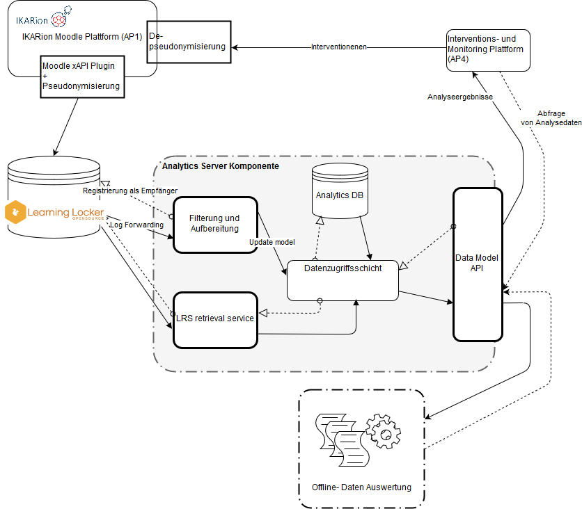

# IKARion Data Infrastructure


This software was created as part of the
[IKARion Project](https://www.ikarion-projekt.de/)
which coducts research about supporting small groups
in online learning environments.
The full architecture of the system can be seen in
the following picture. After that instructions
on how to setup this backend follow.



It is an analytics backend that takes trace user data
generated in moodle and logged via the 
XAPI standard. It processes the data
and provides endpoints for easy querying
of user and group data.
Note that to make use of the capabilites
you should install and setup our customized 
[moodle](https://github.com/IKARion/ikarion_moodle)
which is ready made to log user activity and
extends moodle to include the concept of tasks
that groups can be assigend to.

Once you have moodle setup you should install a
[learning locker](https://docs.learninglocker.net/welcome/)
for managing the xapi statements
generated by moodle. Once you have done so
you need to configure moodle to send statements
to the learning locker.

To setup this backend it is necessary to
have a working instance of [MongoDB](https://www.mongodb.com/)

In the folder /ikarion_datamanagement/ is a
file named example_config.py
From this you can make a configuration file
for the backend. Just copy it as config.py. It needs the address for your
mongodb and the url to your learning locker.
In the learning locker you can also create
[keys and secrets](https://www.youtube.com/watch?v=2LzKtDuokxA)
 for client applications and configure statement
 forwarding.
 Generate a key and secret and add it to your config.
 Next setup the forwarding of XAPI Statements
 to the backend. The backend has an endpoint to
 send statements to for processing. If both are on the same server
 the address to the endpoint that needs to be put in is
 **http://localhost:5000/logs/log_forwarding/**
 
Once this is done you can start the application.
To do this you need a working [python 3](https://www.python.org/download/releases/3.0/)
 installation. Next you need to install the required packages
 In a commandline window write
 ````commandline
pip install -r requirements.txt
````

Once all packages are installed successfully you
need to install the app.
Execute in the top level directory the following command
 ````commandline
python setup.py install
````
Now you can start the app.
To do this you execute the file
**ikarion_data_infrastructure.py**.
You can add the parameter *production* to the
command line call to start the app with production
configuration. Open a commandline in the same directory as the file
and execute.

 ````commandline
python ikarion_data_infrastructure.py production
````

You should see a message that the app is running
at the address *http://0.0.0.0:5000*.
All endpoints to query data are accessible via this
address if you have the app running locally.
 

 


